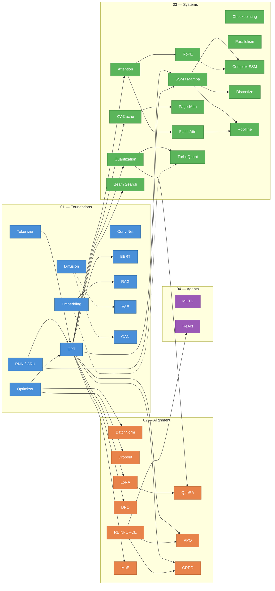

[](https://github.com/no-magic-ai/no-magic)

---


---

# no-magic

**Because `model.fit()` isn't an explanation.**

<video src="https://github.com/user-attachments/assets/f107ed4c-6905-4063-b3f6-a4a3c2f16c8e" width="100%" autoplay loop muted playsinline></video>

---

## What This Is

`no-magic` is a curated collection of single-file, dependency-free Python implementations of the algorithms that power modern AI. Each script is a complete, runnable program — no frameworks, no abstractions, no hidden complexity. Most scripts train from scratch: some train one model and then use it for inference, others train alternative variants side by side and compare them (often running inference too). A smaller set runs untrained forward-pass mechanisms or non-learning algorithms. Each script's kind is recorded explicitly (see [Script contracts](#script-contracts)).

Every script in this repository is an **executable proof** that these algorithms are simpler than the industry makes them seem. The goal is not to replace PyTorch or TensorFlow — it's to make you dangerous enough to understand what they're doing underneath.

## See It In Action

<details open>
<summary><h3>01 — Foundations (16 scripts)</h3></summary>
<table>
<tr>
<td align="center"><a href="01-foundations/microgpt.py"><b>Autoregressive GPT</b></a><br/>
<br/>
<sub>Token-by-token generation</sub></td>
<td align="center"><a href="01-foundations/micrornn.py"><b>RNN vs GRU</b></a><br/>
<br/>
<sub>Vanishing gradients and gating</sub></td>
<td align="center"><a href="01-foundations/microlstm.py"><b>LSTM</b></a><br/>
<br/>
<sub>4-gate memory highway</sub></td>
</tr>
<tr>
<td align="center"><a href="01-foundations/microtokenizer.py"><b>BPE Tokenizer</b></a><br/>
<br/>
<sub>Iterative pair merging → vocabulary</sub></td>
<td align="center"><a href="01-foundations/microembedding.py"><b>Word Embeddings</b></a><br/>
<br/>
<sub>Contrastive learning → semantic clusters</sub></td>
<td align="center"><a href="01-foundations/microrag.py"><b>RAG Pipeline</b></a><br/>
<br/>
<sub>Retrieve → augment → generate</sub></td>
</tr>
<tr>
<td align="center"><a href="01-foundations/microbert.py"><b>BERT</b></a><br/>
<br/>
<sub>Bidirectional attention + [MASK] prediction</sub></td>
<td align="center"><a href="01-foundations/microconv.py"><b>Convolutional Net</b></a><br/>
<br/>
<sub>Sliding kernels → feature maps</sub></td>
<td align="center"><a href="01-foundations/microresnet.py"><b>ResNet</b></a><br/>
<br/>
<sub>F(x) + x = gradient highway</sub></td>
</tr>
<tr>
<td align="center"><a href="01-foundations/microvit.py"><b>Vision Transformer</b></a><br/>
<br/>
<sub>Image patches as tokens</sub></td>
<td align="center"><a href="01-foundations/microdiffusion.py"><b>Diffusion</b></a><br/>
<br/>
<sub>Noise → data via iterative denoising</sub></td>
<td align="center"><a href="01-foundations/microvae.py"><b>VAE</b></a><br/>
<br/>
<sub>Encode → sample z → decode</sub></td>
</tr>
<tr>
<td align="center"><a href="01-foundations/microgan.py"><b>GAN</b></a><br/>
<br/>
<sub>Generator vs discriminator minimax</sub></td>
<td align="center"><a href="01-foundations/microoptimizer.py"><b>Optimizers</b></a><br/>
<br/>
<sub>SGD vs Momentum vs Adam convergence</sub></td>
<td></td>
</tr>
</table>

**Comparison programs without a preview:** [attention_vs_none.py](01-foundations/attention_vs_none.py) · [rnn_vs_gru_vs_lstm.py](01-foundations/rnn_vs_gru_vs_lstm.py)

</details>

<details>
<summary><h3>02 — Alignment & Training (10 scripts)</h3></summary>
<table>
<tr>
<td align="center"><a href="02-alignment/microlora.py"><b>LoRA Fine-tuning</b></a><br/>
<br/>
<sub>Low-rank weight injection</sub></td>
<td align="center"><a href="02-alignment/microqlora.py"><b>QLoRA</b></a><br/>
<br/>
<sub>4-bit base + full-precision adapters</sub></td>
<td align="center"><a href="02-alignment/microdpo.py"><b>DPO Alignment</b></a><br/>
<br/>
<sub>Preferred vs. rejected → policy update</sub></td>
</tr>
<tr>
<td align="center"><a href="02-alignment/microppo.py"><b>PPO (RLHF)</b></a><br/>
<br/>
<sub>Clipped policy gradient for alignment</sub></td>
<td align="center"><a href="02-alignment/microgrpo.py"><b>GRPO</b></a><br/>
<br/>
<sub>Group-relative rewards, no critic</sub></td>
<td align="center"><a href="02-alignment/microreinforce.py"><b>REINFORCE</b></a><br/>
<br/>
<sub>Log P(a) × reward = gradient</sub></td>
</tr>
<tr>
<td align="center"><a href="02-alignment/micromoe.py"><b>Mixture of Experts</b></a><br/>
<br/>
<sub>Sparse routing to specialist MLPs</sub></td>
<td align="center"><a href="02-alignment/microbatchnorm.py"><b>Batch Normalization</b></a><br/>
<br/>
<sub>Normalize activations → stable training</sub></td>
<td align="center"><a href="02-alignment/microdropout.py"><b>Dropout</b></a><br/>
<br/>
<sub>Kill neurons → prevent overfitting</sub></td>
</tr>
</table>

**Comparison program without a preview:** [adam_vs_sgd.py](02-alignment/adam_vs_sgd.py)

</details>

<details>
<summary><h3>03 — Systems & Inference (17 scripts)</h3></summary>
<table>
<tr>
<td align="center"><a href="03-systems/microattention.py"><b>Attention Mechanism</b></a><br/>
<br/>
<sub>Q·K<sup>T</sup> → softmax → weighted V</sub></td>
<td align="center"><a href="03-systems/microflash.py"><b>Flash Attention</b></a><br/>
<br/>
<sub>Tiled O(N) memory computation</sub></td>
<td align="center"><a href="03-systems/microrope.py"><b>RoPE</b></a><br/>
<br/>
<sub>Position via rotation matrices</sub></td>
</tr>
<tr>
<td align="center"><a href="03-systems/microkv.py"><b>KV-Cache</b></a><br/>
<br/>
<sub>Memoize keys/values — stop recomputing</sub></td>
<td align="center"><a href="03-systems/micropaged.py"><b>PagedAttention</b></a><br/>
<br/>
<sub>OS-style paged KV-cache memory</sub></td>
<td align="center"><a href="03-systems/microquant.py"><b>Quantization</b></a><br/>
<br/>
<sub>Float32 → Int8 = 4x compression</sub></td>
</tr>
<tr>
<td align="center"><a href="03-systems/microbeam.py"><b>Beam Search</b></a><br/>
<br/>
<sub>Tree search with top-k pruning</sub></td>
<td align="center"><a href="03-systems/microcheckpoint.py"><b>Checkpointing</b></a><br/>
<br/>
<sub>O(n) → O(√n) memory via recompute</sub></td>
<td align="center"><a href="03-systems/microparallel.py"><b>Model Parallelism</b></a><br/>
<br/>
<sub>Tensor + pipeline across devices</sub></td>
</tr>
<tr>
<td align="center"><a href="03-systems/microssm.py"><b>State Space Models</b></a><br/>
<br/>
<sub>Linear-time selective state transitions</sub></td>
<td align="center"><a href="03-systems/microvectorsearch.py"><b>Vector Search</b></a><br/>
<br/>
<sub>Exact vs LSH approximate search</sub></td>
<td align="center"><a href="03-systems/microbm25.py"><b>BM25</b></a><br/>
<br/>
<sub>TF → TF-IDF → BM25 evolution</sub></td>
</tr>
<tr>
<td align="center"><a href="03-systems/microspeculative.py"><b>Speculative Decoding</b></a><br/>
<br/>
<sub>Draft fast, verify once</sub></td>
<td align="center"><a href="03-systems/microcomplexssm.py"><b>Complex SSM</b></a><br/>
<br/>
<sub>Complex eigenvalues = real + RoPE</sub></td>
<td align="center"><a href="03-systems/microdiscretize.py"><b>Discretization</b></a><br/>
<br/>
<sub>Euler vs ZOH vs Trapezoidal</sub></td>
</tr>
<tr>
<td align="center"><a href="03-systems/microroofline.py"><b>Roofline Model</b></a><br/>
<br/>
<sub>SISO → MIMO hardware utilization</sub></td>
<td align="center"><a href="03-systems/microturboquant.py"><b>TurboQuant</b></a><br/>
<br/>
<sub>Data-oblivious quantization via random rotation</sub></td>
<td></td>
</tr>
</table>

</details>

<details>
<summary><h3>04 — Agents & Planning (5 scripts)</h3></summary>
<table>
<tr>
<td align="center"><a href="04-agents/micromcts.py"><b>Monte Carlo Tree Search</b></a><br/>
<br/>
<sub>UCB1 tree search + random rollouts</sub></td>
<td align="center"><a href="04-agents/microreact.py"><b>ReAct Agent</b></a><br/>
<br/>
<sub>Thought → Action → Observation</sub></td>
<td align="center"><a href="04-agents/microbandit.py"><b>Multi-Armed Bandits</b></a><br/>
<br/>
<sub>ε-greedy vs UCB1 vs Thompson Sampling</sub></td>
</tr>
<tr>
<td align="center"><a href="04-agents/microminimax.py"><b>Minimax + Alpha-Beta</b></a><br/>
<br/>
<sub>Adversarial search with pruning</sub></td>
<td align="center"><a href="04-agents/micromemory.py"><b>Memory-Augmented Network</b></a><br/>
<br/>
<sub>Differentiable read/write heads</sub></td>
<td></td>
</tr>
</table>

</details>

> All algorithms have animated visualizations. Full 1080p60 videos in [Releases](https://github.com/no-magic-ai/no-magic/releases).
> Visualization source and rendering: [no-magic-viz](https://github.com/no-magic-ai/no-magic-viz) — built with [Manim](https://www.manim.community/).

## Philosophy

Modern ML education has a gap. There are thousands of tutorials that teach you to call library functions, and there are academic papers full of notation. What's missing is the middle layer: **the algorithm itself, expressed as readable code**.

This project follows a strict set of constraints:

- **One file, one algorithm.** Every script is completely self-contained. No imports from local modules, no `utils.py`, no shared libraries.
- **Zero external dependencies.** Only Python's standard library. If it needs `pip install`, it doesn't belong here.
- **A recorded lifecycle.** Most scripts train a model and then use it for inference, and many trained comparisons do too; the exceptions (comparisons that stop at the comparison, untrained forward-pass demonstrations and non-learning algorithms) are recorded per script. See [Script contracts](#script-contracts) and [`docs/catalog.json`](docs/catalog.json).
- **Designed to run in minutes on a CPU.** No GPU required. No cloud credits. Scripts are written to finish on a laptop CPU; the tier READMEs show historical timings recorded when each script was added, which are not a current measurement of every script.
- **Comments are mandatory, not decorative.** Every script must be readable as a guided walkthrough of the algorithm. We are not optimizing for line count — we are optimizing for understanding. See `CONTRIBUTING.md` for the full commenting standard.

## Who This Is For

- **ML engineers** who use frameworks daily but want to understand the internals they rely on.
- **Students** transitioning from theory to practice who want to see algorithms as working code, not just equations.
- **Career switchers** entering ML who need intuition for what's actually happening when they call high-level APIs.
- **Researchers** who want minimal reference implementations to prototype ideas without framework overhead.
- **Anyone** who has ever stared at a library call and thought: _"but what is it actually doing?"_

This is not a beginner's introduction to programming. You should be comfortable reading Python and have at least a surface-level familiarity with ML concepts. The scripts will give you the depth.

## What You'll Find Here

The repository is organized into four tiers based on conceptual dependency:

### 01 — Foundations (16 scripts)

Core algorithms that form the building blocks of modern AI systems. GPT, RNN, LSTM, BERT, CNN, ResNet, ViT, GAN, VAE, diffusion, embeddings, tokenization, RAG, and optimizer comparison. Includes comparison scripts for attention mechanisms and recurrent architectures.

See [`01-foundations/README.md`](01-foundations/README.md) for the full algorithm list, timing data, and roadmap.

### 02 — Alignment & Training Techniques (10 scripts)

Methods for steering, fine-tuning, and aligning models after pretraining. LoRA, QLoRA, DPO, PPO, GRPO, REINFORCE, MoE, batch normalization, dropout/regularization, and optimizer comparison.

See [`02-alignment/README.md`](02-alignment/README.md) for the full algorithm list, timing data, and roadmap.

### 03 — Systems & Inference (17 scripts)

The engineering that makes models fast, small, and deployable. Attention variants, Flash Attention, KV-cache, PagedAttention, RoPE, quantization, beam search, checkpointing, parallelism, SSMs, vector search, BM25, speculative decoding, complex SSM equivalence, discretization methods, and roofline analysis.

See [`03-systems/README.md`](03-systems/README.md) for the full algorithm list, timing data, and roadmap.

### 04 — Agents & Planning (5 scripts)

Autonomous reasoning and decision-making. Monte Carlo Tree Search for strategic planning, ReAct agents for tool-augmented reasoning loops, multi-armed bandits for exploration/exploitation, minimax with alpha-beta pruning for adversarial search, and memory-augmented networks for persistent agent memory.

See [`04-agents/README.md`](04-agents/README.md) for the full algorithm list, timing data, and roadmap.

### Script contracts

[`docs/catalog.json`](docs/catalog.json) is generated by [`scripts/generate_catalog.py`](scripts/generate_catalog.py) from explicit per-script records; it is never hand-edited. For the 48 scripts it currently lists, it records:

- **Teaching kind** — assigned from each script's default program, checked in this order:
  - `comparison` (15 scripts) trains two or more alternative arms for a common task and reports arm-versus-arm quality or training-cost results, e.g. `micrornn` (RNN vs GRU), `microbatchnorm`, `microoptimizer`, `microcheckpoint`. Many of these also run inference; `comparison` is not a no-inference label.
  - `train_infer` (25) trains one model and then uses it for inference, generation, decisions or evaluation. This includes one trained model run through alternative decoders or serving methods (`microbeam`, `microkv`, `microquant`); a draft or reference model trained only to support decoding, and the stages of one training pipeline (`microlora`, `microdpo`), are not separate arms.
  - `forward_pass` (4: `microattention`, `microflash`, `micropaged`, `microrope`) runs untrained forward computations.
  - `algorithm_demo` (4: `microbm25`, `microvectorsearch`, `microturboquant`, `micromcts`) runs non-learning algorithms.
- **Data source** — `names_download` (23 scripts download Karpathy's makemore `names.txt` on first run) or `in_script` (25 scripts generate or embed their data).
- **Paper slug** — the [no-magic-papers](https://github.com/no-magic-ai/no-magic-papers) card each script links to. Script slugs (file basenames such as `microgpt`) and paper slugs (card names such as `gpt-1`) are separate namespaces; every link is written out in the generator and never derived from a name.
- **Adaptation note** — where a script differs from its linked card. For example, `microgpt` links to the GPT-1 card while its source follows a GPT-2-style architecture with RMSNorm, ReLU and no biases and has no task fine-tuning stage; `microvectorsearch` implements LSH, not the HNSW index of its card. These notes describe the code as it is; they do not claim paper-scale results, and a script without a note is not thereby claimed to replicate its card exactly.

`python scripts/generate_catalog.py --check` exits non-zero without writing when the committed catalog is not byte-identical to the generated output. It is a local maintainer command; pull-request CI does not run it today. After changes reach `main`, the existing Update Catalog workflow (`.github/workflows/catalog.yml`) regenerates `docs/catalog.json` and commits any difference; that keeps `main` current but does not check pull requests.

## How to Use This Repo

```bash
# Clone the repository
git clone https://github.com/no-magic-ai/no-magic.git
cd no-magic

# Pick any script and run it
python 01-foundations/microgpt.py
```

That's it. No virtual environments, no dependency installation, no configuration. The 23 scripts whose catalog `data_source` is `names_download` fetch makemore's `names.txt` with `urllib` on first run, so that first run needs network access; the file is cached as `names.txt` in the directory you run from and reused from there. The other 25 scripts generate or embed their data and need no network.

### Minimum Requirements

- Python 3.10+
- 8 GB RAM
- Any modern CPU (2019-era or newer)

### Quick Start Path

If you're working through the scripts systematically, this subset builds core concepts incrementally:

```text
microtokenizer.py     → How text becomes numbers
microembedding.py     → How meaning becomes geometry
microgpt.py           → How sequences become predictions
micrornn.py           → How recurrence models sequences
microlstm.py          → How gated memory solves vanishing gradients
microbert.py          → How bidirectional context differs from autoregressive
microconv.py          → How spatial filters extract features
microvit.py           → How transformers see images
microbatchnorm.py     → How normalizing activations stabilizes training
microlora.py          → How fine-tuning works efficiently
microdpo.py           → How preference alignment works
microattention.py     → How attention actually works (all variants)
microrope.py          → How position gets encoded through rotation
microquant.py         → How models get compressed
microflash.py         → How attention gets fast
microssm.py           → How Mamba models bypass attention entirely
microdiscretize.py    → How discretization shapes what SSMs can learn
microcomplexssm.py    → How complex eigenvalues enable rotation (parity)
microroofline.py      → Why more FLOPs can be faster (SISO → MIMO)
microreact.py         → How agents reason with tools
```

Each tier's README has the full algorithm list with measured run times for that category.

## Learning Resources

### Challenges

"Predict the behavior" exercises that test your understanding of the algorithms. 21 challenges covering all 4 tiers — attention, GPT, GAN, DPO, optimizers, discretization, complex SSMs, roofline, tokenizer, embedding, RNN, VAE, LoRA, PPO, MoE, KV-cache, quantization, TurboQuant, SSM, MCTS, and ReAct. Each challenge presents a code snippet and asks you to reason about the output before running it.

See [`challenges/README.md`](challenges/README.md) for the full challenge set.

### Flashcards

Anki-compatible flashcard decks for spaced repetition review. 190 cards across 4 tiers (foundations, alignment, systems, agents), covering key concepts, equations, and design decisions from every script.

```bash
# Generate the Anki decks (needs the genanki package)
uv run --no-project --with genanki python resources/flashcards/generate_anki.py
```

The script writes `no-magic-foundations.apkg`, `no-magic-alignment.apkg`, `no-magic-systems.apkg` and a combined `no-magic-complete.apkg` (170 cards) next to itself; `agents.csv` (20 cards) is not exported. Anki renders card fields as HTML, so angle-bracket notation that a browser would read as a tag, such as an inner product `<a,b>`, is written with Unicode brackets `⟨a, b⟩` or the entities `&lt;` and `&gt;`. A `<` or `>` followed by a space or digit, as in `< 1`, is ordinary visible text and is left as written. See [`resources/flashcards/`](resources/flashcards/) for the raw card data and generation script.

### Learning Path

Structured tracks for different goals — 7 learning tracks ranging from weekend sprints to a full curriculum. Each track orders scripts by conceptual dependency and includes time estimates, prerequisites, and milestone markers. In the Transformer, Alignment and Modern Inference tracks every step also gives its exact command, data needs, source/paper/preview links, a predict-before-run question with a checked answer and the limits of what the program shows.

See [`LEARNING_PATH.md`](LEARNING_PATH.md) for the full guide.

### Offline Book (EPUB)

All 48 scripts compiled into a single EPUB with table of contents, thesis excerpts, tradeoff sections, and full annotated source. Readable on any e-reader, tablet, or phone.

```bash
# Requires pandoc: brew install pandoc (macOS) or apt install pandoc
bash scripts/generate-epub.sh
# Output: build/no-magic.epub
```

A pre-built copy is included in every [release](https://github.com/no-magic-ai/no-magic/releases).

## Translations

Comment translations for 6 languages: Spanish, Portuguese, Chinese, Japanese, Korean, and Hindi. The code stays in English — only comments, docstrings, section headers, and print statements are translated.

See [`TRANSLATIONS.md`](TRANSLATIONS.md) for full status and contributor guide.

Want to help translate? See the [translation guide](translations/README.md).

## Dependency Graph

How the algorithms connect conceptually. Arrows mean "understanding A helps with B" — not code imports (every script is fully self-contained).



**Legend:** <span style="color:#4a90d9">Foundations</span> · <span style="color:#e8834a">Alignment</span> · <span style="color:#5bb55b">Systems</span> · <span style="color:#9b59b6">Agents</span> — Solid arrows = strong prerequisite, dashed arrows = conceptual comparison.

## Related Projects

- [micrograd](https://github.com/karpathy/micrograd) — Karpathy's autograd engine. The `Value` class in `microgpt.py` descends from this.
- [makemore](https://github.com/karpathy/makemore) — Character-level language modeling. `micrornn.py` covers similar ground in a single comparative file.

## Inspiration & Attribution

This project is directly inspired by [Andrej Karpathy's](https://github.com/karpathy) extraordinary work on minimal implementations — particularly [micrograd](https://github.com/karpathy/micrograd), [makemore](https://github.com/karpathy/makemore), and the `microgpt.py` script that demonstrated the entire GPT algorithm in a single dependency-free Python file.

Karpathy proved that there's enormous demand for "the algorithm, naked." `no-magic` extends that philosophy across the full landscape of modern AI/ML.

## How This Was Built

I built this project with help from multiple AI coding agents. I chose the algorithms, designed the structure and learning paths, set the constraints, and guided the implementation. The agents helped with both the code and the supporting materials, from visualizations and exercises to flashcards, EPUB generation, and translations. I reviewed the results.

This is how I build in 2026. I'd rather be upfront about it.

## Star History

<a href="https://www.star-history.com/?repos=Mathews-Tom%2Fno-magic&type=date&legend=top-left">
 <picture>
   <source media="(prefers-color-scheme: dark)" srcset="https://api.star-history.com/image?repos=no-magic-ai/no-magic&type=date&theme=dark&legend=top-left&v=2&new=2" />
   <source media="(prefers-color-scheme: light)" srcset="https://api.star-history.com/image?repos=no-magic-ai/no-magic&type=date&legend=top-left&v=2&new=2" />
   
 </picture>
</a>

## Contributing

Contributions are welcome, but the constraints are non-negotiable. See `CONTRIBUTING.md` for the full guidelines. The short version:

- One file. Zero dependencies. Trains and infers, unless the script's recorded teaching kind is a documented exception.
- If your PR adds a `requirements.txt`, it will be closed.
- Quality over quantity. Each script should be the **best possible** minimal implementation of its algorithm.

## License

MIT — use these however you want. Learn from them, teach with them, build on them.

---

_The constraint is the product. Everything else is just efficiency._

_v3.0.0 — April 2026_
